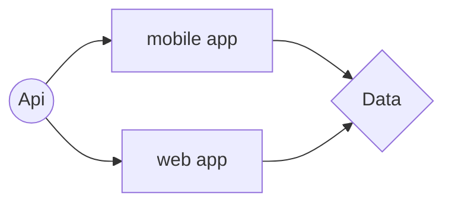
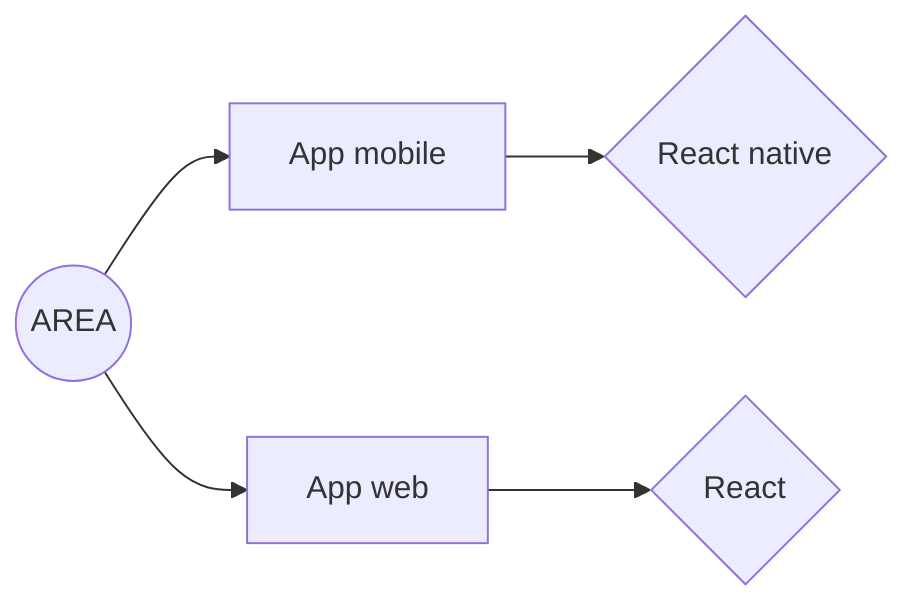
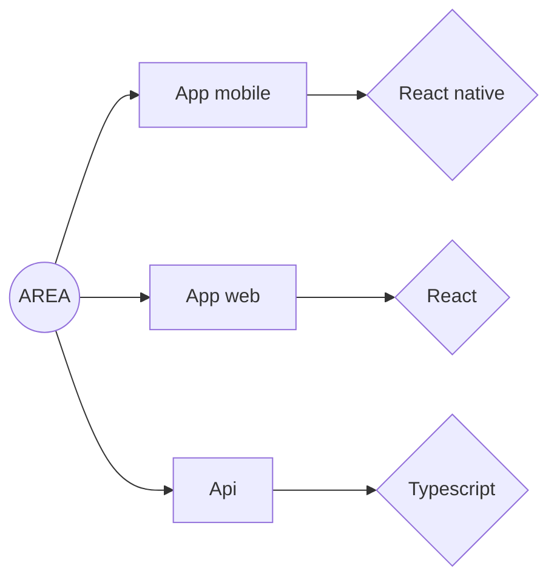
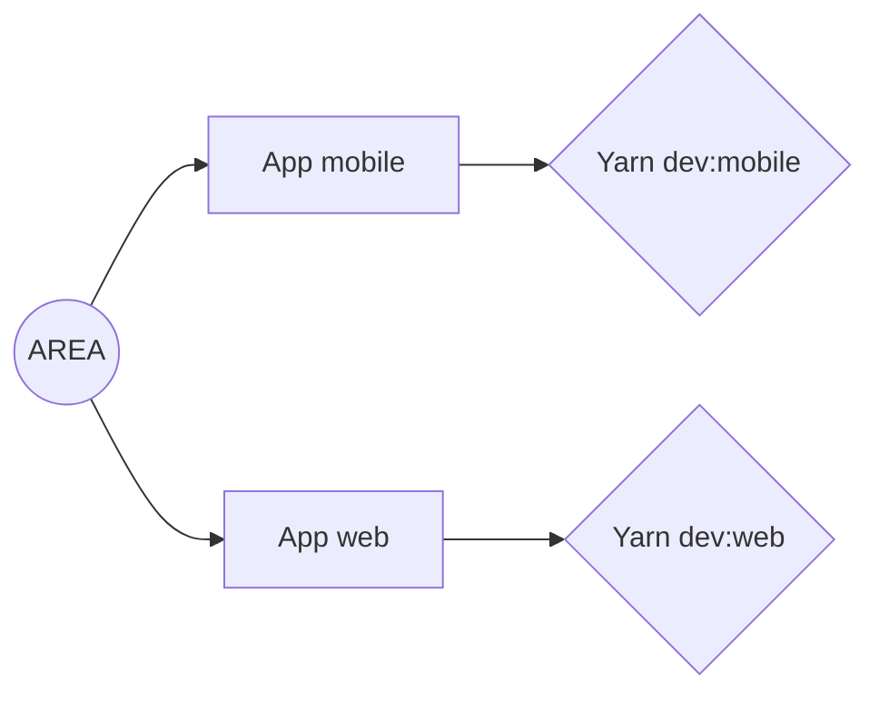

<!-- AUTO-GENERATED-CONTENT:START (STARTER) -->

  

<h2 align="center">
  User documentation AREA project
</h2>

this project was carried out as part of the end of our 3rd year by the team

- Auguste THOMANN
- Dorian SCHLOSSER
- Patrick EIERMANN
- Clement MUTH
- Kilian MAI

## SUMMARY
- **general information**
- **environment**
- **Technical part**

## GÉNÉRAL INFORMATION

- **Directory** : B-YEP-500-STG-5-1-yearendproject-auguste.thomann
 - **Language** : React native, Typescript, Post gre, graph QL
 - **Compilation method** : docker-compose build && docker-compose up

## ENVIRONMENT

- **Technical environment** :

> web  [link]().
>  mobile application [link]().

- **fonctionnal environment** :

> Project Management [Discord](https://discord.com/)
> Hosting project under [Github](http://github.com)

## TECHNICAL PART

### SERVICES

- Google
- Microsoft
- Twitch
- Spotify
- Discord
- Github

### Front-end

### Back-end

### Testing

### DB 

# Install
- Prerequisites.
  > Docker
- Step 1.
  > sudo docker-compose up 
  > sudo docker-compose build
- Step 2.
  
  > _`yarn dev:mobile`_: Runs the `yarn dev` command in every project and pipe output to the console.
  > _`yarn dev:web`_: Runs the `yarn dev` command in nextjs app

  > launch [AREA](http://localhost/8081)
  
